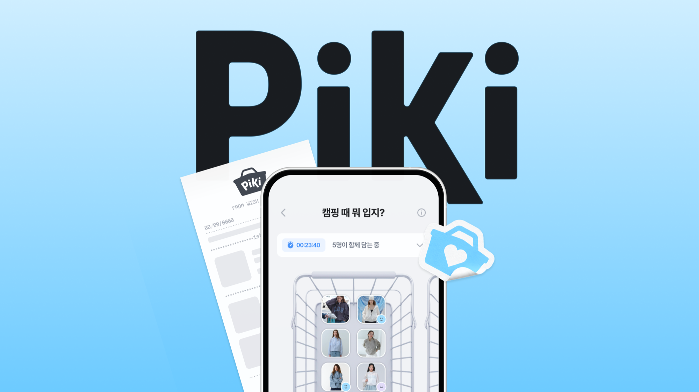
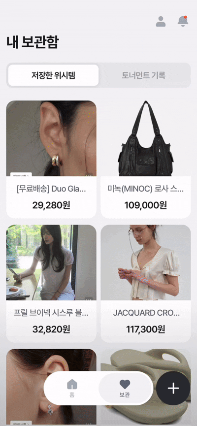
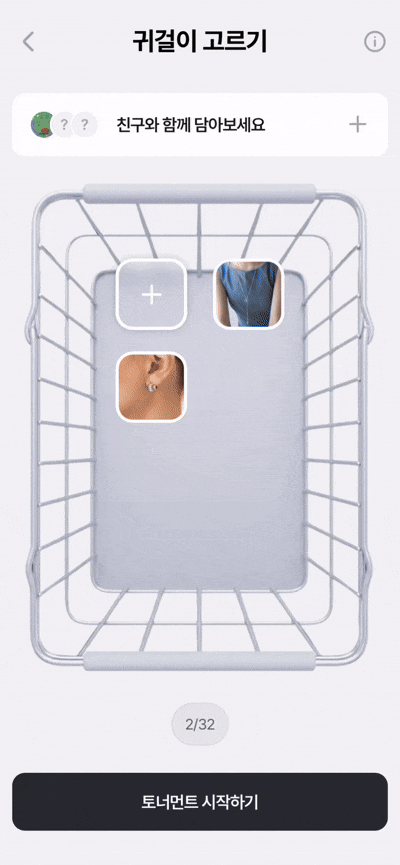
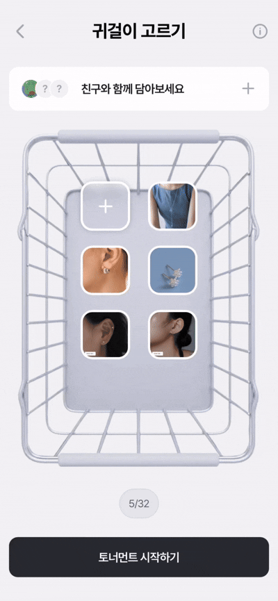
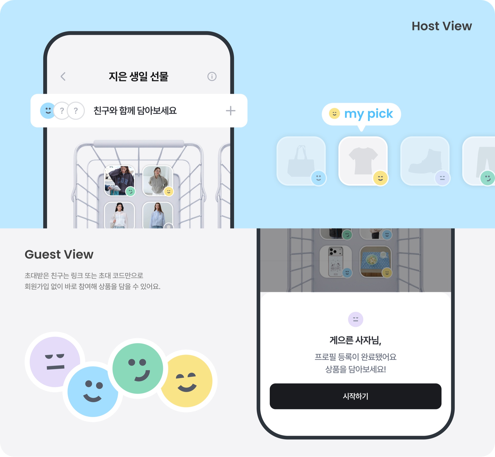
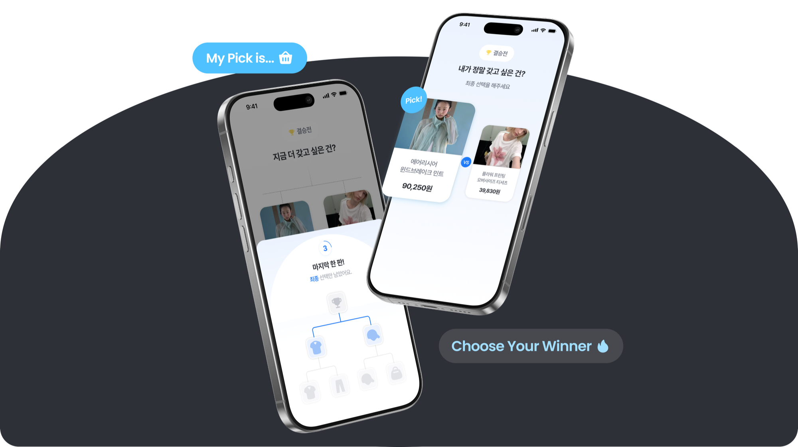
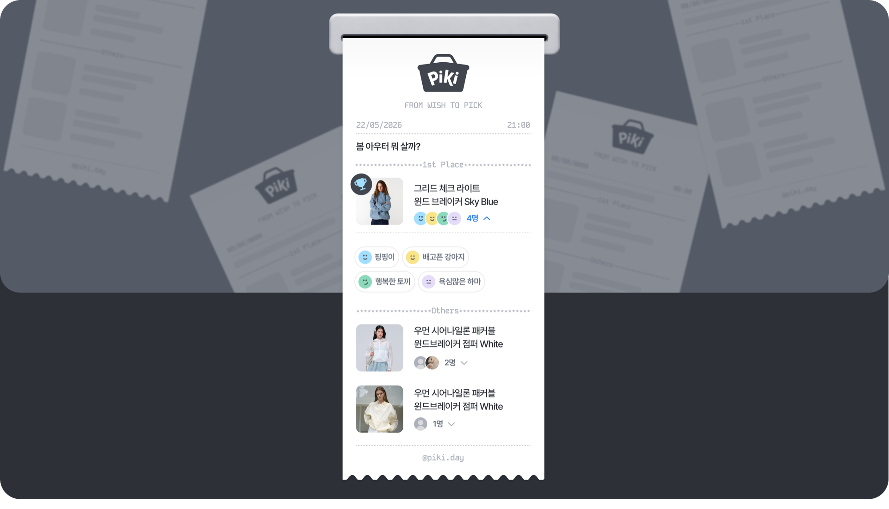
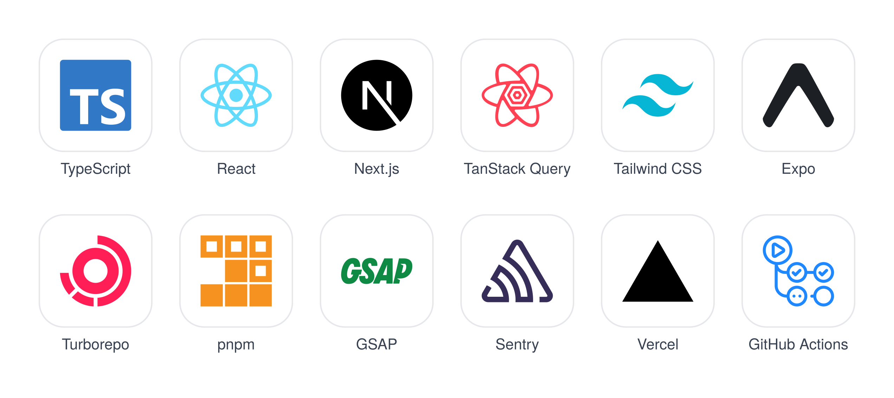
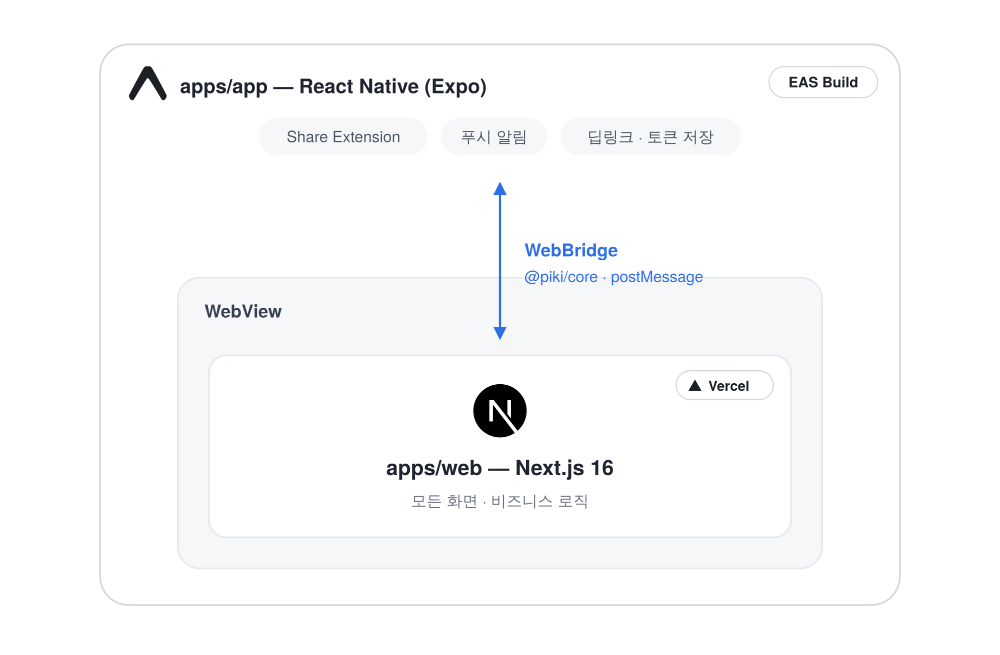

# Saved a lot, bought nothing?
`PiKi`는 쌓아둔 위시템을 토너먼트로 비교해 `직접 결정`하게 도와주는 서비스예요.

### 모아서 
29CM, 무신사, 지그재그 어디서 발견했든 원하는 상품을 한곳에 모아보세요.

### 비교해서
모인 후보를 비슷한 가격대끼리 1:1 토너먼트로 붙여요. 
고민은 짧게, 선택은 둘 중 하나만! 라운드가 올라갈수록 내 취향이 선명해져요.

### 함께
친구를 초대해 같이 담고, 대신 골라주고, 때로는 모은 후보를 토너먼트째 선물해요.  
초대 링크 하나면 회원가입 없이 바로 참여할 수 있어요!

## ✨ 주요 기능

### 1. 위시템 가져오기
29CM, 무신사, 지그재그 어디서 발견했든 원하는 상품을 PiKi에 바로 가져올 수 있어요. 

| 앱 공유로 가져오기 | 이미지로 가져오기 | 링크로 가져오기 |
| :---------------: | :---------: | :-----------: |
|  |  |  |

### 2. 친구 초대하기
링크·초대 코드로 친구를 초대할 수 있어요. 혼자 고민하기보다, 함께 고르면 더 즐거워요.
 

### 3. 토너먼트로 고르기
토너먼트 시작 전, 담긴 후보를 **비슷한 가격대끼리 자동 매칭**해 공정한 1:1 대진표를 만들어요.  
이후 후보를 하나씩 선택하며 가장 갖고 싶은 아이템을 가려내고, 남은 선택 수와 대진표를 함께 보여줘 **결승까지 얼마나 왔는지** 한눈에 보이게 했어요.

### 4. 결과 저장·공유하기
결과를 **영수증 형태로 저장·공유**해요. 친구도 같은 토너먼트에 참여해 서로의 선택을 비교할 수 있어요.

## Tech Stacks

## Architecture

## 🏡 팀원

|  |  |  |  |
|:---------:|:---------:|:---------:|:---------:|
| <a href="https://github.com/iodio89">정선아</a> | <a href="https://github.com/soyeong0115">박소영</a> | <a href="https://github.com/kanghaeun">강하은</a> | <a href="https://github.com/ychany">조영찬</a> |
